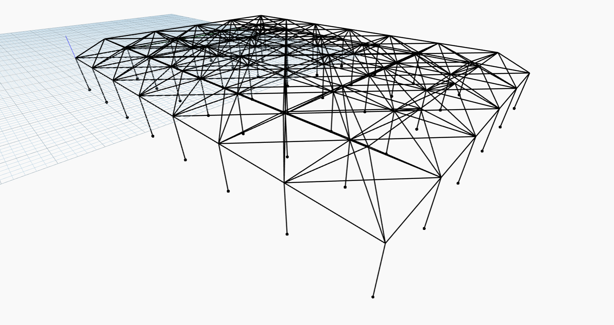
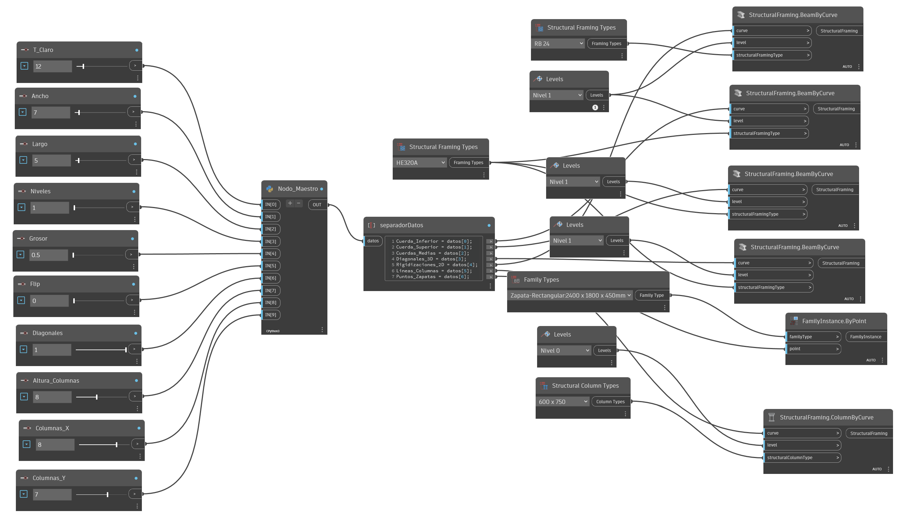
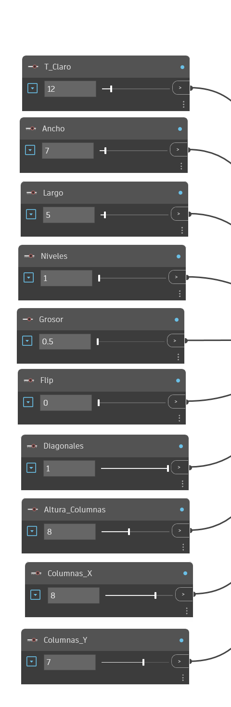
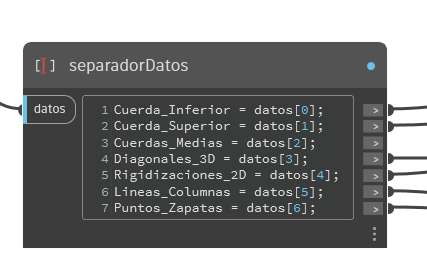
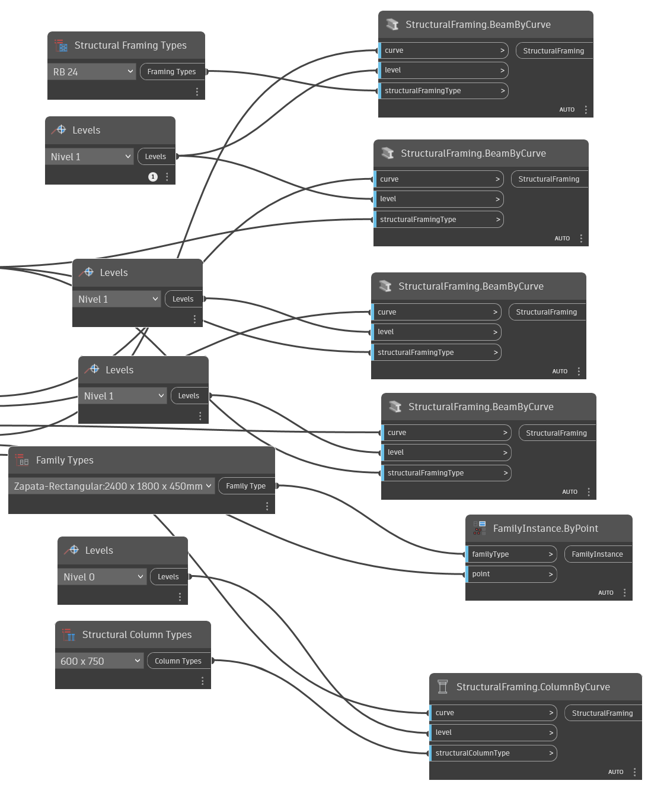

# Parametric Generation of Spatial Structures: `parametric_structer.dyn` Script

[Parametric Structure]

Welcome to the official technical documentation of the Dynamo script **`parametric_structure.dyn`**. This repository serves as a portfolio to demonstrate advanced generative design and logical programming capabilities in Python, applied to structural engineering and the AEC (Architecture, Engineering & Construction) industry.

Computational modeling is not merely a tool; it represents a methodological evolution. Geometric automation via custom scripts allows BIM/VDC specialists to iterate complex designs in milliseconds, eliminate human error in massive profile placement, and guarantee the integrity of the structural database.

Below is a comprehensive breakdown of the computational logic behind this parametric spatial truss generator.

[Workspace Dynamo]

---

## 📑 Table of Contents

1. [Parametric Inputs and Initial Variables](#1-parametric-inputs-and-initial-variables)
2. [Spatial Matrix Generation (Point Grids)](#2-spatial-matrix-generation-point-grids)
3. [Vector Classification and Truss Framing Algorithm](#3-vector-classification-and-truss-framing-algorithm)
4. [Parametric Logic for Supports and Foundations](#4-parametric-logic-for-supports-and-foundations)
5. [Data Output (DesignScript) and Physical Integration in Revit](#5-data-output-designscript-and-physical-integration-in-revit)
6. [Flowchart Suggestions](#6-flowchart-suggestions)

---

## 1. Parametric Inputs and Initial Variables

The **`parametric_structer`** script is designed for complete flexibility using a graphical user interface driven by `NumberInputNode` (Sliders) in Dynamo. These input values are passed directly into the Python node to trigger the mathematical calculations.

The primary variables in the Python environment are defined as follows:
* **`L`**: Base module grid length (extracted as `float(IN[0])`).
* **`U`**: Number of module repetitions along the X-axis (`int(IN[1])`).
* **`V`**: Number of module repetitions along the Y-axis (`int(IN[2])`).
* **`num_niveles`**: Number of structural levels or layers, enforced to a minimum of 1 via `max(1, int(IN[3]))`.
* **`factor_grosor`**: Parametric height multiplier (`float(IN[4])`) used to adjust overall structural depth.
* **`flip`**: Directional switch (`int(IN[5])`) defining growth along the Z-axis (upward or downward).
* **`diag_cruzadas`**: Boolean flag (`int(IN[6])`) to enable or disable horizontal plane cross-bracing diagonals.
* **`H_columna`**: Clear height of supporting columns (`float(IN[7])`).
* **`num_cols_u`**: Support count distributed along the X-axis (`int(IN[8])`).
* **`num_cols_v`**: Support count distributed along the Y-axis (`int(IN[9])`).

[Init variables in sliders]

### Base Height Calculation
To maintain spatial geometric proportions, the layer spacing (`H_base`) is automatically calculated using trigonometric ratios. The script computes `H_base = L * (math.sqrt(2.0) / 2.0) * factor_grosor`, ensuring that diagonal bracing angles dynamically scale relative to module length and thickness factors.

$$H_{base} = L \cdot \left(\frac{\sqrt{2}}{2}\right) \cdot factor\_grosor$$

---

## 2. Generation of the Spatial Matrix (Point Meshes)

The creation of the truss begins with the instantiation of a three-dimensional array of points using the geometric API (Autodesk.DesignScript.Geometry.Point).   To achieve the interwoven topology characteristic of spatial meshes, the algorithm parametrically shifts the grid on the odd layers:   

```python
# 2. Point Grid Generation
mallas_puntos = []
for k in range(num_niveles + 1):
    z_actual = k * H_base * direccion_z
    capa_k = []
    if k % 2 == 0:
        for i in range(U + 1):
            fila = []
            for j in range(V + 1):
                fila.append(Point.ByCoordinates(i * L, j * L, z_actual))
            capa_k.append(fila)
    else:
        for i in range(U):
            fila = []
            for j in range(V):
                fila.append(Point.ByCoordinates((i * L) + (L / 2.0), (j * L) + (L / 2.0), z_actual))
            capa_k.append(fila)
    mallas_puntos.append(capa_k)
```

### Shift Logic:
The `for k in range(num_niveles + 1)` $$Z_{actual} = k \cdot H_{base} \cdot direccion\_z$$ loop iterates through each level on the Z-axis. The `if k % 2 == 0` $$(X_{par}, Y_{par}) = (i \cdot L, j \cdot L)$$ condition separates the even layers from the odd ones. While the even layers start their matrix at the origin coordinate of each module (`i * L, j * L`) $$(X_{par}, Y_{par}) = (i \cdot L, j \cdot L)$$, the odd layers experience an exact offset of half the module (`(i * L) + (L / 2.0)`) $$(X_{impar}, Y_{impar}) = \left(i \cdot L + \frac{L}{2}, j \cdot L + \frac{L}{2}\right)$$ along the $$X$$ and $$Y$$ axes. This guarantees that the upper nodes always coincide with the centroid of the lower base module.

## 3. Vector Classification and Truss Framing Algorithm
Once point grids are generated, the algorithm draws wireframe geometry (`Line.ByStartPointEndPoint`) and categorizes members for Revit element assignment.

```python
# 3. Truss Member Classification
cuerdas_inferiores, cuerdas_superiores, cuerdas_intermedias = [], [], []
diagonales_espacio, diagonales_planas = [], []

# Member generation & horizontal classification
for k in range(num_niveles + 1):
    # ... (U and V direction line generation)
    if diag_cruzadas == 1:
        for i in range(filas - 1):
            for j in range(columnas - 1):
                diagonales_planas.append(Line.ByStartPointEndPoint(pts[i][j], pts[i+1][j+1]))
                diagonales_planas.append(Line.ByStartPointEndPoint(pts[i+1][j], pts[i][j+1]))
    
    if k == 0:
        cuerdas_inferiores.extend(barras_capa)
    elif k == num_niveles:
        cuerdas_superiores.extend(barras_capa)
    else:
        cuerdas_intermedias.extend(barras_capa)

# 3D Space Diagonals Generation
for k in range(num_niveles):
    pts_inf, pts_sup = mallas_puntos[k], mallas_puntos[k + 1]
    # Iteration connecting shifted nodes to their 4 nearest lower/upper nodes...
```
### Member Classification Logic
* **Bottom Chords:** Collected when layer index `k == 0` (bottom tier).

* **Top Chords:** Identified when reaching the top layer (`k == num_niveles`).

* **Intermediate Chords:** Any horizontal layer located between top and bottom chords (`else`).

* **3D Space Diagonals:** Interconnect nodes in odd layers to their four adjacent grid points in even layers (and vice versa), forming pyramidal 3D trusses.

* **2D Flat Diagonals:** When `diag_cruzadas == 1`, cross-bracing members are generated across horizontal grid bays.

## 4. Parametric Logic for Supports and Foundations
To ensure structural buildability, columns are systematically distributed along the perimeter or interior based on `num_cols_u` and `num_cols_v` inputs.

$$Indice_u = \text{round}\left( i \cdot \frac{U}{num\_cols\_u - 1} \right)$$

```python
# 1. Slider input reading with exception handling
try:
    num_cols_u = int(IN[8])
    num_cols_v = int(IN[9])
except:
    num_cols_u = 3 
    num_cols_v = 3

# 2. Parametric axis distribution
indices_u = [int(round(i * U / float(num_cols_u - 1))) for i in range(num_cols_u)]
# ...

# 3. Grid mapping and [X][Y] vs [Y][X] matrix index handling
for i, j in apoyos_indices:
    try:
        p_base = mallas_puntos[0][i_seguro][j_seguro]
    except:
        p_base = mallas_puntos[0][j_seguro][i_seguro]
        
    p_suelo = Point.ByCoordinates(p_base.X, p_base.Y, p_base.Z - H_columna)
    
    puntos_cimentacion.append(p_suelo)
    ejes_columnas.append(Line.ByStartPointEndPoint(p_suelo, p_base))
```

### Logic Analysis
* **Safety and Reliability** (`try...except`): Prevents script execution failure in Dynamo when slider inputs unbind or fail to initialize. A default fallback of 3 supports per axis is assigned automatically.

* **Handling of Matrix Transpositions:** Dynamo can transpose nested lists during geometry operations. The algorithm attempts `[i_seguro][j_seguro]` indexing and, upon catching an IndexError, automatically swaps indices to `[j_seguro][i_seguro]` to avoid breaking the script.

* **Ground Extrapolation:** Base points are projected downward along the $$Z-axis$$ using `p_base.Z - H_columna` to establish precise footing insertion coordinates.
$$Z_{suelo} = Z_{base} - H_{columna}$$

## 5. Data Output (DesignScript) and Physical Integration in Revit
To map abstract geometric lines to physical Building Information Modeling (BIM) elements, the Python script packages output lists into a single `OUT` variable with 7 indexed sublists.

In Dynamo, a Code Block node unbinds these arrays via native DesignScript syntax:

```python
Cuerda_Inferior   = datos[0];
Cuerda_Superior   = datos[1];
Cuerdas_Medias    = datos[2];
Diagonales_3D     = datos[3];
Rigidizaciones_2D = datos[4];
Lineas_Columnas   = datos[5];
Puntos_Zapatas    = datos[6];
```
[Separete outputs]

### Materialization via the Revit API
Automation builds real structural BIM models within seconds:

* **Beams and Tensioners:** The extracted curves are injected into `StructuralFraming.BeamByCurve` nodes linked to reference levels, automatically instantiating steel profiles such as **HE320A** for main chords and cylindrical **RB 24** sections for diagonal bracing.

* **Columns:** Vertical lines (`ejes_columnas`) connect to `StructuralFraming.ColumnByCurve` nodes, assigning family types such as 600 x 750mm rectangular columns.

* **Foundations:** Ground points (`p_suelo`) feed into `FamilyInstance.ByPoint` nodes, placing isolated footing families (e.g., **Zapata-Rectangular: 2400 x 1800 x 450mm**) at exact spatial locations.

[Section of BIM instance]

## 6. Flowchart Suggestions
For inclusion in project manuals, technical presentations, or architectural reports, the workflow can be represented with the following logic structure:

* **Start Block / Inputs:** UI Sliders Units -> `IN[0...9]`.

* **Mathematical Operator (Proportion Calculation):** Trigonometric validation of `H_base`.

* **Topology Loop (Nested Loop):** Generation of `Point.ByCoordinates` Grid -> Even/Odd Conditional Branching (Half-module offset).

* **Curve Generator:** Iterative creation of structural member lines via `Line.ByStartPointEndPoint`.

* **Logical Classifier:** Member separation into top/bottom chords, web diagonals, and planar bracing.

* **Column Interpolator:** Column line creation down to `Z - H_columna` with matrix index fallback.

* **Data Output (Code Block):** Output array index extraction (`OUT[0..6]`).

* **BIM Instantiation:** Direct model writing via `StructuralFraming` and `FamilyInstance` nodes in Revit.

Here the video dynamo to Revit.

<video width="320" height="240" controls>
  <source src="Ejemplo.mp4" type="video/mp4">
</video>